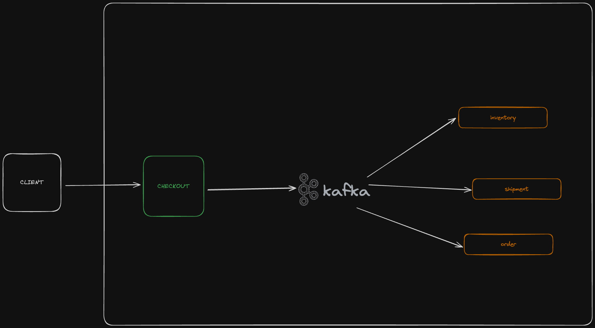

# Checkout Journey

This project aims to simulate a checkout system. It uses event-driven architecture to simulate the checkout process. Event sourcing is used to store the state of the checkout system. 
ss
It consist of these technologies:

- Kafka
- Go + Fiber
- Docker
- Next.js(Client)

## Diagram

Whenever a checkout is created, a checkout event is published to the `checkout` topic. There are consumers that listen to this topic and do their work. 

